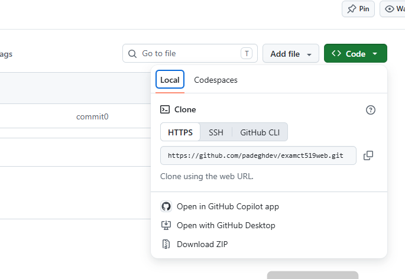
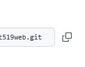

"examination CT519 : Web" 
 
Web site ข้อมูลนักศึกษา 

Features หลัก
แสดงชื่อ นามสกุล รหัสนักศึกษา
แสดงข้อมูลเกี่ยวกับตนเอง งานอดิเรก กีฬาที่ชอบ
แสดงรายละเอียดงานวิจัยที่สนใจ
 

Installtion
### ก่อนอื่น ขอให้ตรวจสอบว่าในระบบของท่าน ได้ทำการติดตั้ง docker เรียบร้อยแล้ว

### เริ่มทำการดึง File จาก git hub

**assume ว่าท่านกำลังอยู่ที่หน้า page ของ Github**
1. กด ปุ่ม code สีเขียว 
2. จะมีหน้าจอ ขนาดเล็ก เปิดขึ้นมา 

3. ใหท่านกดปุ่ม ที้เป็ฯ สี่เหลี่ยมซ้อนกัน (ตามภาพ)

4. 

1. ท่านควรสร้าง folder ขึ้นมาใหม่ตามที่ต้องการ
2. ใช้คำสั่ง cd เข้าไปใน folder ดังกล่าว 
3. ใช้คำสั่ง git clone ลงในเครื่องของท่าน
เมื่อfile ทั้งหมด อยู่ในเครื่องแล้ว

### ทำการติดตั้ง บนเครื่องของท่าน

2. ให้ท่าน อยู่ที่ path เดียวกันกับ file ชื่อ docker-compose.yml
ใช้คำสั่ง docker compose up -d --build ระบบจะทำการดึงโปรแกรม ต่างๆ ที่เกี่ยวข้อง เข้าสู่ระบบ
ใช้คำสั่ง docker ps เพื่อตรวจสอบว่า มี container ถูกสรา้งขึ้นหรือไม่
เปิด broswe tabที่ 1 : สำหรับในส่วนของ pgadmin url: => http://<ip address เครื่องของท่าน>:5055
เปิด broswe tabที่ 2 : สำหรับในส่วนของ web application url: => http://<ip address เครื่องของท่าน>:5000
